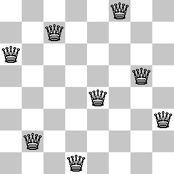

# N-Queen
체스판은 8 * 8 개의 정사각형으로 흰 칸, 검은 칸이 교차되며 나누어져 있습니다. 체스의 기물 중 가장 강력한 말은 퀸으로, 퀸은 자신의 위치에서 가로, 세로, 대각선에 있는 모든 적을 공격할 수 있습니다.

만약 N * N 개의 정사각형으로 된 체스판이 있다면, 서로 공격당하지 않도록 N개의 퀸을 둘 수 있는 경우는 몇 가지가 있을까요?

예를들어 일반적인 8 * 8인 체스판에서 퀸을 다음 그림과 같이 배치하면 모든 퀸은 서로를 공격하고 있지 않으므로 둘 수 있는 하나의 경우가 됩니다.

nQueen 함수를 제작하여 경우의 수를 반환하여 주세요. 예를 들어 N = 3이라면 0을 반환해 주면 됩니다.